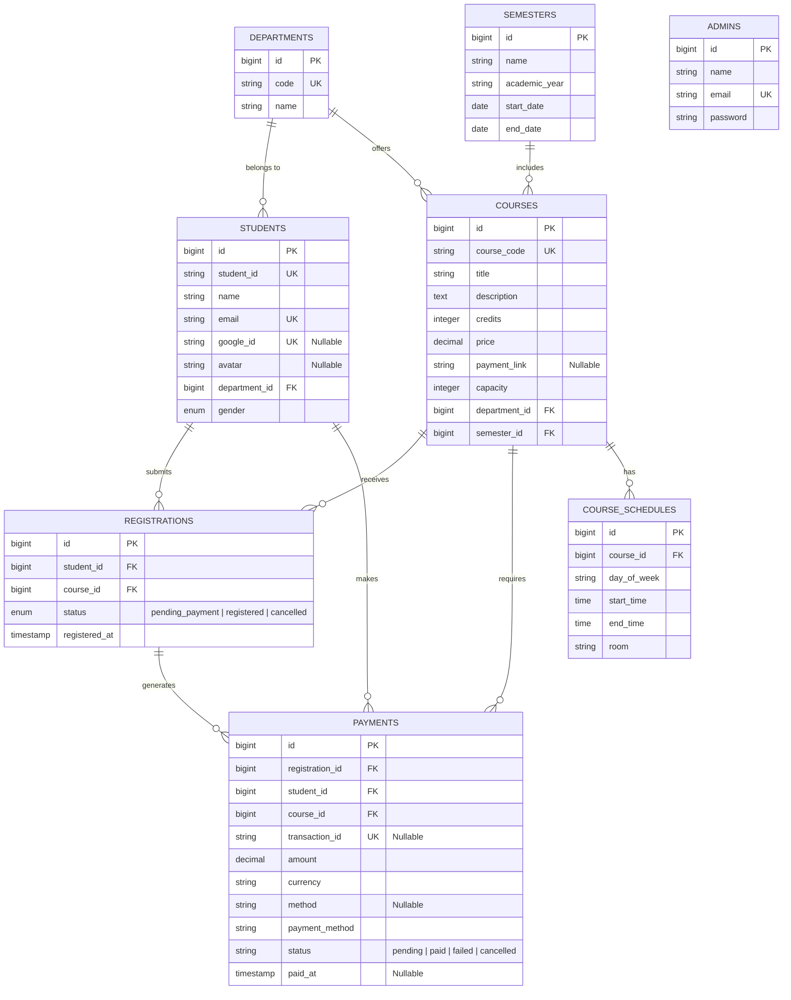

# Course Register System (CRS) — Database Documentation & ERD

## 1. Executive Overview

The **Course Register System (CRS)** is a web application designed for university course enrollment and tuition payment management.

The system supports two distinct roles:
1. **Student**: Explores course offerings, registers for courses, completes tuition payments online via **ABA PayWay**, updates profile details (including profile picture uploads), and authenticates via native credentials or **Google OAuth Login**.
2. **Admin**: Manages departments, courses, schedules, monitors student enrollments, and oversees payment logs.

---

## 2. Business / Domain Database Scope

This database documentation strictly details the **domain and business database schema**. 

### Excluded Framework Infrastructure Tables
System infrastructure tables managed internally by the Laravel framework are excluded from the business domain model:
- `migrations`
- `cache`, `cache_locks`
- `sessions`
- `jobs`, `job_batches`, `failed_jobs`
- `password_reset_tokens`
- `personal_access_tokens`

---

## 3. Entity Relationship Diagram (ERD)

---

## 4. Database Schema Specifications

| Notation | Meaning |
| :--- | :--- |
| **PK** | Primary Key |
| **FK** | Foreign Key |
| **UK** | Unique Key |

---

### 4.1 `departments`
Stores academic department classifications within the university (e.g., Computer Science, Business Administration).

| Column | Type / Keys | Description |
| :--- | :--- | :--- |
| `id` | `bigint` **(PK)** | Primary key identifier |
| `code` | `string` **(UK)** | Unique department abbreviation code (e.g., `CS`, `BA`) |
| `name` | `string` | Full name of the academic department |
| `created_at` | `timestamp` | Record creation timestamp |
| `updated_at` | `timestamp` | Record modification timestamp |

---

### 4.2 `semesters`
Defines academic terms and academic year windows for course scheduling.

| Column | Type / Keys | Description |
| :--- | :--- | :--- |
| `id` | `bigint` **(PK)** | Primary key identifier |
| `name` | `string` | Term name (e.g., `Semester 1`, `Fall 2026`) |
| `academic_year` | `string` | Academic year designation (e.g., `2025-2026`) |
| `start_date` | `date` | Term start date |
| `end_date` | `date` | Term completion date |
| `created_at` | `timestamp` | Record creation timestamp |
| `updated_at` | `timestamp` | Record modification timestamp |

---

### 4.3 `students`
Stores registered university student profiles, login credentials, Google OAuth linkage, and custom profile picture uploads.

| Column | Type / Keys | Description |
| :--- | :--- | :--- |
| `id` | `bigint` **(PK)** | Primary key identifier |
| `student_id` | `string` **(UK)** | Unique student ID card number (e.g., `STU001`) |
| `name` | `string` | Student's full name |
| `email` | `string` **(UK)** | Primary email address used for login and notifications |
| `password` | `string` | Hashed password (nullable for Google Single Sign-On users) |
| `google_id` | `string` **(UK, Nullable)** | Unique Google OAuth ID for SSO authentication |
| `avatar` | `string` **(Nullable)** | File path or URL to the student's uploaded profile image |
| `department_id` | `bigint` **(FK)** | References `departments(id)` |
| `gender` | `enum('male','female')` | Student gender classification |
| `created_at` | `timestamp` | Record creation timestamp |
| `updated_at` | `timestamp` | Record modification timestamp |

---

### 4.4 `admins`
Stores administrative staff accounts responsible for system administration and monitoring.

| Column | Type / Keys | Description |
| :--- | :--- | :--- |
| `id` | `bigint` **(PK)** | Primary key identifier |
| `name` | `string` | Administrator's full name |
| `email` | `string` **(UK)** | Admin login email address |
| `password` | `string` | Hashed password |
| `created_at` | `timestamp` | Record creation timestamp |
| `updated_at` | `timestamp` | Record modification timestamp |

---

### 4.5 `courses`
Holds catalog information for academic courses offered by departments.

| Column | Type / Keys | Description |
| :--- | :--- | :--- |
| `id` | `bigint` **(PK)** | Primary key identifier |
| `course_code` | `string` **(UK)** | Unique course code (e.g., `CS201`) |
| `title` | `string` | Course title |
| `description` | `text` | Detailed course overview and curriculum summary |
| `credits` | `integer` | Academic credit hours |
| `price` | `decimal(8,2)` | Tuition fee in USD ($) |
| `payment_link` | `string` **(Nullable)** | Pre-created ABA PayWay sandbox/live payment link URL |
| `capacity` | `integer` | Maximum seat capacity for enrollment |
| `department_id` | `bigint` **(FK)** | References `departments(id)` |
| `semester_id` | `bigint` **(FK)** | References `semesters(id)` |
| `created_at` | `timestamp` | Record creation timestamp |
| `updated_at` | `timestamp` | Record modification timestamp |

---

### 4.6 `course_schedules`
Manages weekly lecture times, days, and room assignments for courses.

| Column | Type / Keys | Description |
| :--- | :--- | :--- |
| `id` | `bigint` **(PK)** | Primary key identifier |
| `course_id` | `bigint` **(FK)** | References `courses(id)` on cascade delete |
| `day_of_week` | `string` | Scheduled day (e.g., `Monday`, `Wednesday`) |
| `start_time` | `time` | Class start time |
| `end_time` | `time` | Class end time |
| `room` | `string` | Classroom or laboratory room number |
| `created_at` | `timestamp` | Record creation timestamp |
| `updated_at` | `timestamp` | Record modification timestamp |

---

### 4.7 `registrations`
Tracks student course registration submissions and lifecycle states.

| Column | Type / Keys | Description |
| :--- | :--- | :--- |
| `id` | `bigint` **(PK)** | Primary key identifier |
| `student_id` | `bigint` **(FK)** | References `students(id)` |
| `course_id` | `bigint` **(FK)** | References `courses(id)` |
| `status` | `enum` | Enrollment state (`pending_payment`, `registered`, `cancelled`) |
| `registered_at` | `timestamp` | Timestamp when registration was submitted |
| `created_at` | `timestamp` | Record creation timestamp |
| `updated_at` | `timestamp` | Record modification timestamp |

> **Constraint**: `UNIQUE(student_id, course_id)` prevents duplicate active enrollments per student per course.

---

### 4.8 `payments`
Stores financial transactions, gateway responses, and audit records for online tuition payments.

| Column | Type / Keys | Description |
| :--- | :--- | :--- |
| `id` | `bigint` **(PK)** | Primary key identifier |
| `registration_id` | `bigint` **(FK)** | References `registrations(id)` |
| `student_id` | `bigint` **(FK)** | References `students(id)` |
| `course_id` | `bigint` **(FK)** | References `courses(id)` |
| `transaction_id` | `string` **(UK, Nullable)** | ABA PayWay transaction reference string |
| `amount` | `decimal(8,2)` | Payment amount billed ($ USD) |
| `currency` | `string(3)` | Currency code (default: `USD`) |
| `method` | `string` **(Nullable)** | Gateway identifier (e.g., `aba_payway`) |
| `payment_method` | `string` | Human-readable payment method description |
| `status` | `string` | Payment lifecycle state (`pending`, `paid`, `failed`, `cancelled`) |
| `gateway_response` | `json` **(Nullable)** | Full response payload from ABA PayWay API verification |
| `paid_at` | `timestamp` **(Nullable)** | Timestamp when payment was confirmed |
| `created_at` | `timestamp` | Record creation timestamp |
| `updated_at` | `timestamp` | Record modification timestamp |

---

## 5. Domain Architecture & Integration Summary

1. **User Roles**: Exclusively **Student** and **Admin**. All references to legacy Instructor roles have been removed.
2. **Google OAuth SSO Integration**: `students.google_id` supports seamless single sign-on using Google accounts via Laravel Socialite.
3. **Student Profile Image Management**: `students.avatar` allows students to edit their profile details and upload custom profile pictures.
4. **ABA PayWay Payment Integration**: `courses.payment_link` stores pre-created ABA PayWay checkout links. When a student registers, a `payments` record is initialized (`pending`), and verified server-side with ABA's `checkTransaction` API before transitioning `registrations.status` to `registered`.
