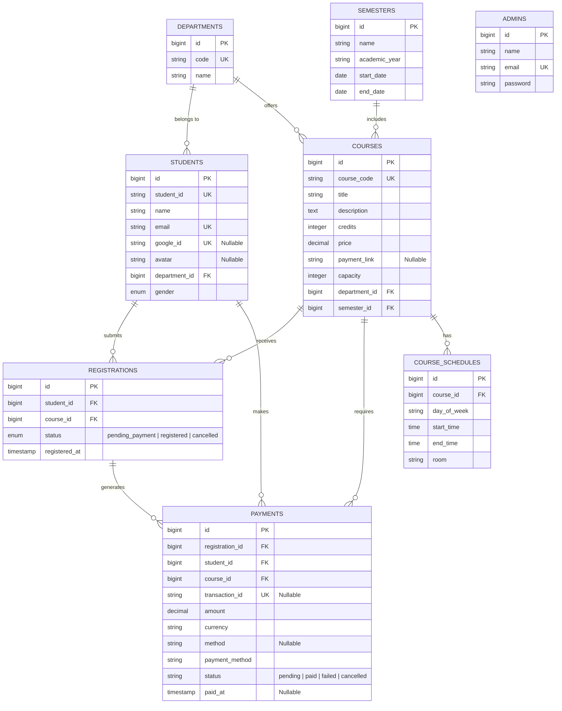

# Course Register System (CRS) — Database Documentation & ERD

## 1. System Overview

The **Course Register System (CRS)** is a web-based course registration and student management platform designed for universities. It enables students to explore available academic courses, register for courses, make online tuition payments via **ABA PayWay**, manage their profile details (including uploading a custom profile picture), and authenticate securely via traditional credentials or **Google OAuth Login**. Admins manage academic offerings, departments, semesters, student enrollments, and payment audit logs.

The project supports two user roles: **Student** and **Admin**.

---

## 2. Business / Domain Database Scope

This documentation focuses exclusively on the core **business and domain database schema** required for course registration, student management, and payment processing. 

### Excluded Framework Infrastructure Tables
Per software architecture best practices, standard Laravel framework implementation tables are excluded from domain documentation:
- `migrations`
- `cache` & `cache_locks`
- `sessions`
- `jobs` & `job_batches` & `failed_jobs`
- `password_reset_tokens`
- `personal_access_tokens`

---

## 3. Entity Relationship Diagram (ERD)

---

## 4. Database Schema Specifications

### 4.1 `departments`
Stores university academic departments (e.g., Computer Science, Business Administration).
- **id** (PK): Unique primary key identifier.
- **code** (UK): Short department code (e.g., `CS`, `BA`).
- **name**: Full department title.
- **created_at / updated_at**: Standard timestamps.

### 4.2 `semesters`
Defines academic terms and academic year windows.
- **id** (PK): Unique primary key identifier.
- **name**: Term designation (e.g., `Fall`, `Spring`, `Semester 1`).
- **academic_year**: Academic year string (e.g., `2025-2026`).
- **start_date**: Term start date.
- **end_date**: Term completion date.
- **created_at / updated_at**: Standard timestamps.

### 4.3 `students`
Stores registered university student profiles, login credentials, Google OAuth linkage, and avatar images.
- **id** (PK): Primary key identifier.
- **student_id** (UK): Unique university student identification code (e.g., `STU001`).
- **name**: Student's full name.
- **email** (UK): Primary email address used for login and notifications.
- **password**: Encrypted password hash (nullable if authenticated exclusively via Google OAuth).
- **google_id** (UK, Nullable): Unique Google OAuth identifier for seamless single sign-on (SSO).
- **avatar** (Nullable): File path or URL to the student's uploaded profile picture.
- **department_id** (FK): References `departments(id)` to link the student to an academic department.
- **gender**: Gender classification (`male`, `female`).
- **created_at / updated_at**: Standard timestamps.

### 4.4 `admins`
Stores administrative staff accounts responsible for system oversight.
- **id** (PK): Primary key identifier.
- **name**: Admin full name.
- **email** (UK): Administrator email address used for admin portal login.
- **password**: Encrypted password hash.
- **created_at / updated_at**: Standard timestamps.

### 4.5 `courses`
Holds catalog details for subject courses offered by departments.
- **id** (PK): Primary key identifier.
- **course_code** (UK): Unique catalog identifier (e.g., `CS201`, `MATH101`).
- **title**: Course name.
- **description**: Summary of curriculum content.
- **credits**: Academic credit value.
- **price**: Tuition cost in USD ($).
- **payment_link** (Nullable): Pre-created ABA PayWay sandbox or live payment link URL for instant checkout.
- **capacity**: Maximum student enrollment limit.
- **department_id** (FK): References `departments(id)`.
- **semester_id** (FK): References `semesters(id)`.
- **created_at / updated_at**: Standard timestamps.

### 4.6 `course_schedules`
Manages weekly lecture times, days, and room locations for courses.
- **id** (PK): Primary key identifier.
- **course_id** (FK): References `courses(id)` on cascade deletion.
- **day_of_week**: Day designation (e.g., `Monday`, `Wednesday`).
- **start_time**: Session start time.
- **end_time**: Session end time.
- **room**: Building or classroom location.
- **created_at / updated_at**: Standard timestamps.

### 4.7 `registrations`
Tracks course enrollment records and payment workflow states for students.
- **id** (PK): Primary key identifier.
- **student_id** (FK): References `students(id)`.
- **course_id** (FK): References `courses(id)`.
- **status**: Enrollment state enum:
  - `pending_payment`: Initial state awaiting tuition payment.
  - `registered`: Fully confirmed enrollment after successful payment.
  - `cancelled`: Cancelled enrollment (allows student re-registration).
- **registered_at**: Timestamp when registration attempt initiated.
- **created_at / updated_at**: Standard timestamps.
- **Constraints**: `UNIQUE(student_id, course_id)` prevents duplicate active enrollments per student.

### 4.8 `payments`
Stores financial transactions, gateway responses, and audit details for course tuition.
- **id** (PK): Primary key identifier.
- **registration_id** (FK): References `registrations(id)`.
- **student_id** (FK): References `students(id)`.
- **course_id** (FK): References `courses(id)`.
- **transaction_id** (UK, Nullable): External ABA PayWay transaction reference ID.
- **amount**: Monetary amount billed ($ USD).
- **currency**: Three-letter currency code (default: `USD`).
- **method** (Nullable): Legacy payment gateway method identifier (e.g., `aba_payway`).
- **payment_method**: Payment channel description (e.g., `ABA PayWay Payment Link`).
- **status**: Payment lifecycle state (`pending`, `paid`, `failed`, `cancelled`).
- **gateway_response** (Nullable): JSON payload returned by ABA PayWay API for verification audit.
- **paid_at** (Nullable): Timestamp when payment was confirmed.
- **created_at / updated_at**: Standard timestamps.

---

## 5. Key Integrations Overview

### 5.1 Google OAuth Single Sign-On (SSO)
- Integrated via Laravel Socialite.
- Students can authenticate using their Google account.
- If a student logs in via Google for the first time, a new record is created in `students` with `google_id` and their profile picture set in `avatar`.

### 5.2 ABA PayWay Payment Integration
- Payments are initiated via ABA PayWay Payment Links stored in `courses.payment_link`.
- Transactions generate a `payments` record linked to the corresponding `registration`.
- Payments are verified server-side using ABA PayWay's `checkTransaction` API before updating `registrations.status` to `registered`.

### 5.3 Student Profile & Avatar Management
- Students can update their profile information and upload custom avatar images.
- Avatar files are stored securely in storage and linked via `students.avatar`.
