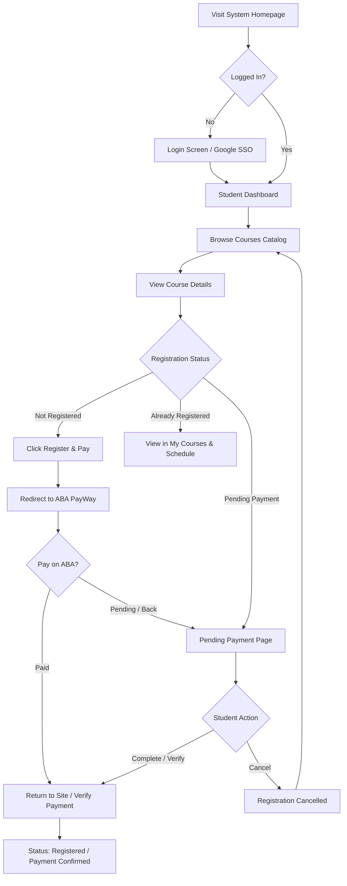
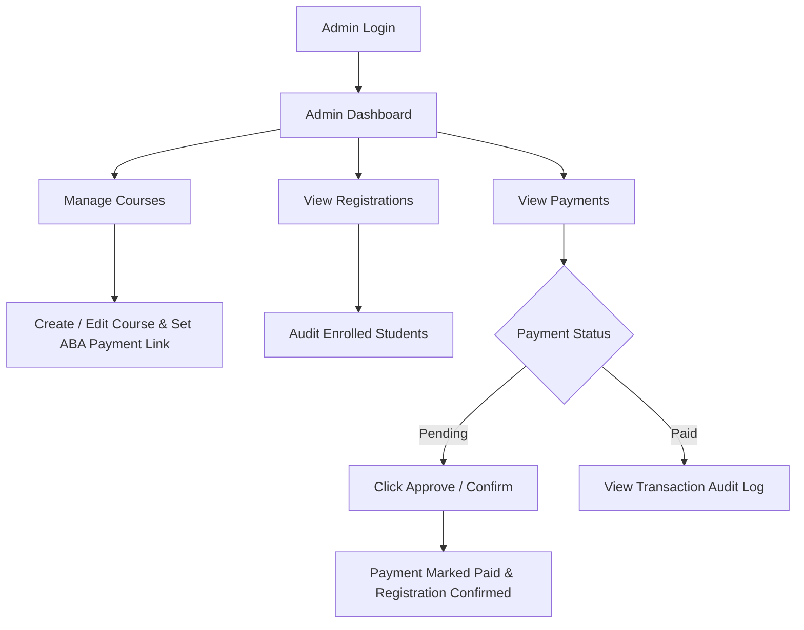
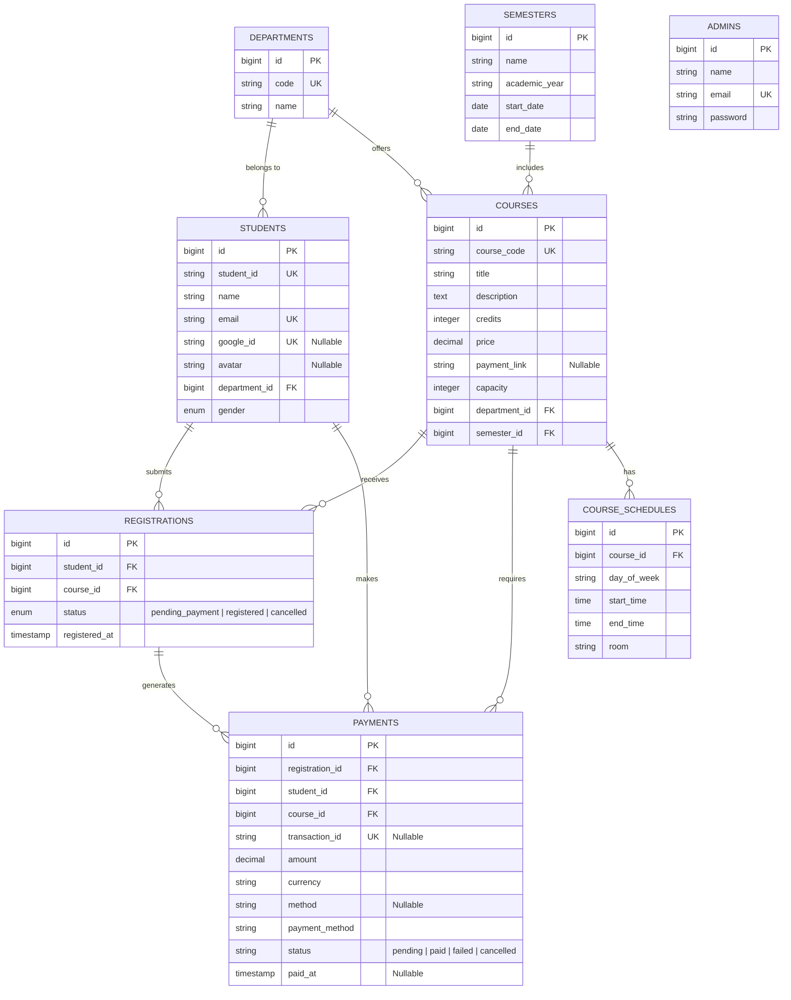

# Course Register System (CRS) — Comprehensive Project Documentation

---

## 1. Project Overview & Features

The **Course Register System (CRS)** is an end-to-end web application developed for university students and administrators. It streamlines academic course registration, schedule tracking, student profile management, and online tuition payments integrated with **ABA PayWay**.

### 1.1 Key Roles
The application supports two user roles:
- **Student**: Registers for courses, pays tuition via ABA PayWay, manages profile and avatar, views schedules and registered courses.
- **Admin**: Manages courses, departments, schedules, reviews student enrollments, and verifies/approves payment transactions.

---

### 1.2 Features & Functions Matrix

#### 🎓 Student Features
1. **Authentication & Single Sign-On (SSO)**
   - Secure login via email/password.
   - **Google OAuth Login** via Laravel Socialite.
2. **Course Exploration & Search**
   - Browse catalog by department, semester, and course code.
   - Search courses dynamically by title or code.
   - View course details, credit hours, seat availability, price, and class schedules.
3. **Course Registration & ABA PayWay Payment**
   - Initiate course registration creating a `pending_payment` state.
   - Redirect to ABA PayWay checkout link.
   - Server-side transaction status check via ABA PayWay API (`checkTransaction`).
   - "Verify / Confirm Paid (Demo)" support for verification testing.
   - Cancel pending registration workflow to allow re-registration.
4. **Schedule & Enrollment Tracking**
   - View weekly timetable of registered classes.
   - Access "My Courses" dashboard with status badges (Registered, Pending Payment).
5. **Student Profile & Image Upload**
   - Update student profile information (name, gender, department).
   - Edit and upload custom profile picture avatar.

#### 🛡️ Admin Features
1. **Dashboard Overview**
   - Real-time statistics: total courses, total students, total registrations, total revenue collected.
2. **Course & Schedule Management**
   - Create, edit, update, and delete courses.
   - Configure course seat capacities, credit hours, prices, and ABA payment links.
   - Assign class schedules (day, start time, end time, classroom).
3. **Student & Registration Audit**
   - View roster of registered students per department.
   - Audit course enrollments and registration statuses.
4. **Payment Verification & Approval**
   - Monitor all payment records (Paid, Pending, Failed/Cancelled).
   - **Confirm & Approve Payment**: Admin can manually confirm/approve pending payments to register students.
   - **Reject Payment**: Admin can reject invalid payment attempts.

---

## 2. Web Technology Stack & Architecture

```text
┌─────────────────────────────────────────────────────────────┐
│                       BOOTSTRAP 5 / BLADE                   │
│               Responsive UI / Web & Mobile Layouts          │
└──────────────────────────────┬──────────────────────────────┘
                               │
┌──────────────────────────────▼──────────────────────────────┐
│                        LARAVEL 12 FRAMEWORK                 │
│        PHP 8.3+ / Eloquent ORM / Auth & Middleware          │
└──────────────┬──────────────────────────────┬───────────────┘
               │                              │
┌──────────────▼──────────────┐  ┌────────────▼──────────────┐
│        MYSQL DATABASE       │  │   ABA PAYWAY / GOOGLE SSO │
│   Normalized InnoDB Schema  │  │   REST API & Payment Link │
└─────────────────────────────┘  └───────────────────────────┘
```

| Technology Layer | Specification / Library | Description |
| :--- | :--- | :--- |
| **Backend Framework** | Laravel 12.x | MVC Web Framework handling routing, ORM, security, and controllers. |
| **Programming Language** | PHP 8.3+ | Core server-side scripting language. |
| **Database Management** | MySQL 8.0 / MariaDB | Relational Database with InnoDB engine and foreign key constraints. |
| **Frontend Framework** | Blade Templating + Bootstrap 5.3 | Responsive UI with Bootstrap Icons and custom CSS tokens. |
| **Payment Gateway** | ABA PayWay API & Payment Links | Cambodian online payment link gateway with SHA-512 HMAC security signature verification. |
| **Authentication** | Native Auth + Laravel Socialite | Session-based authentication with Google OAuth SSO integration. |

---

## 3. Prototype Flow & User Journeys

### 3.1 Student User Journey


### 3.2 Admin User Journey


---

## 4. Database Design & Entity Relationship Diagram (ERD)

Excluding Laravel internal infrastructure tables (`migrations`, `cache`, `sessions`, `jobs`, `password_reset_tokens`), the core domain database consists of **8 business entities**:



---

### 4.1 Schema Specifications Table

| Table Name | Key Columns | Description |
| :--- | :--- | :--- |
| **`departments`** | `id` (PK), `code` (UK) | University academic departments. |
| **`semesters`** | `id` (PK) | Academic terms and year ranges. |
| **`students`** | `id` (PK), `student_id` (UK), `email` (UK), `google_id` (UK, Nullable), `department_id` (FK) | Student user accounts, Google SSO, profile info & avatar image uploads. |
| **`admins`** | `id` (PK), `email` (UK) | Administrative management accounts. |
| **`courses`** | `id` (PK), `course_code` (UK), `department_id` (FK), `semester_id` (FK) | Subject course catalog, price, capacity, and ABA payment link. |
| **`course_schedules`** | `id` (PK), `course_id` (FK) | Weekly timetable sessions and room locations. |
| **`registrations`** | `id` (PK), `student_id` (FK), `course_id` (FK) | Course enrollment records and status (`pending_payment`, `registered`, `cancelled`). |
| **`payments`** | `id` (PK), `registration_id` (FK), `student_id` (FK), `course_id` (FK), `transaction_id` (UK, Nullable) | Financial records, ABA transaction refs, payment status (`pending`, `paid`, `failed`, `cancelled`). |

---

## 5. Executable DDL SQL Statements

Below are the complete, executable MySQL DDL statements to create all 8 domain database tables with full foreign keys and indexes:

```sql
-- =============================================================================
-- COURSE REGISTER SYSTEM (CRS) — COMPLETE DATABASE DDL SCRIPT
-- =============================================================================

SET FOREIGN_KEY_CHECKS = 0;

-- 1. Departments Table
CREATE TABLE IF NOT EXISTS `departments` (
    `id` BIGINT UNSIGNED AUTO_INCREMENT PRIMARY KEY,
    `code` VARCHAR(255) NOT NULL UNIQUE,
    `name` VARCHAR(255) NOT NULL,
    `created_at` TIMESTAMP NULL DEFAULT NULL,
    `updated_at` TIMESTAMP NULL DEFAULT NULL
) ENGINE=InnoDB DEFAULT CHARSET=utf8mb4 COLLATE=utf8mb4_unicode_ci;

-- 2. Semesters Table
CREATE TABLE IF NOT EXISTS `semesters` (
    `id` BIGINT UNSIGNED AUTO_INCREMENT PRIMARY KEY,
    `name` VARCHAR(255) NOT NULL,
    `academic_year` VARCHAR(255) NOT NULL,
    `start_date` DATE NOT NULL,
    `end_date` DATE NOT NULL,
    `created_at` TIMESTAMP NULL DEFAULT NULL,
    `updated_at` TIMESTAMP NULL DEFAULT NULL
) ENGINE=InnoDB DEFAULT CHARSET=utf8mb4 COLLATE=utf8mb4_unicode_ci;

-- 3. Students Table
CREATE TABLE IF NOT EXISTS `students` (
    `id` BIGINT UNSIGNED AUTO_INCREMENT PRIMARY KEY,
    `student_id` VARCHAR(255) NOT NULL UNIQUE,
    `name` VARCHAR(255) NOT NULL,
    `email` VARCHAR(255) NOT NULL UNIQUE,
    `password` VARCHAR(255) NOT NULL,
    `google_id` VARCHAR(255) NULL UNIQUE,
    `avatar` VARCHAR(255) NULL,
    `department_id` BIGINT UNSIGNED NOT NULL,
    `gender` ENUM('male', 'female') NOT NULL DEFAULT 'male',
    `created_at` TIMESTAMP NULL DEFAULT NULL,
    `updated_at` TIMESTAMP NULL DEFAULT NULL,
    CONSTRAINT `fk_students_department` FOREIGN KEY (`department_id`) REFERENCES `departments` (`id`) ON DELETE CASCADE
) ENGINE=InnoDB DEFAULT CHARSET=utf8mb4 COLLATE=utf8mb4_unicode_ci;

-- 4. Admins Table
CREATE TABLE IF NOT EXISTS `admins` (
    `id` BIGINT UNSIGNED AUTO_INCREMENT PRIMARY KEY,
    `name` VARCHAR(255) NOT NULL,
    `email` VARCHAR(255) NOT NULL UNIQUE,
    `password` VARCHAR(255) NOT NULL,
    `created_at` TIMESTAMP NULL DEFAULT NULL,
    `updated_at` TIMESTAMP NULL DEFAULT NULL
) ENGINE=InnoDB DEFAULT CHARSET=utf8mb4 COLLATE=utf8mb4_unicode_ci;

-- 5. Courses Table
CREATE TABLE IF NOT EXISTS `courses` (
    `id` BIGINT UNSIGNED AUTO_INCREMENT PRIMARY KEY,
    `course_code` VARCHAR(255) NOT NULL UNIQUE,
    `title` VARCHAR(255) NOT NULL,
    `description` TEXT NOT NULL,
    `credits` INT NOT NULL,
    `price` DECIMAL(8, 2) NOT NULL DEFAULT 0.00,
    `payment_link` VARCHAR(255) NULL,
    `capacity` INT NOT NULL DEFAULT 30,
    `department_id` BIGINT UNSIGNED NOT NULL,
    `semester_id` BIGINT UNSIGNED NOT NULL,
    `created_at` TIMESTAMP NULL DEFAULT NULL,
    `updated_at` TIMESTAMP NULL DEFAULT NULL,
    CONSTRAINT `fk_courses_department` FOREIGN KEY (`department_id`) REFERENCES `departments` (`id`) ON DELETE CASCADE,
    CONSTRAINT `fk_courses_semester` FOREIGN KEY (`semester_id`) REFERENCES `semesters` (`id`) ON DELETE CASCADE
) ENGINE=InnoDB DEFAULT CHARSET=utf8mb4 COLLATE=utf8mb4_unicode_ci;

-- 6. Course Schedules Table
CREATE TABLE IF NOT EXISTS `course_schedules` (
    `id` BIGINT UNSIGNED AUTO_INCREMENT PRIMARY KEY,
    `course_id` BIGINT UNSIGNED NOT NULL,
    `day_of_week` VARCHAR(255) NOT NULL,
    `start_time` TIME NOT NULL,
    `end_time` TIME NOT NULL,
    `room` VARCHAR(255) NOT NULL,
    `created_at` TIMESTAMP NULL DEFAULT NULL,
    `updated_at` TIMESTAMP NULL DEFAULT NULL,
    CONSTRAINT `fk_schedules_course` FOREIGN KEY (`course_id`) REFERENCES `courses` (`id`) ON DELETE CASCADE
) ENGINE=InnoDB DEFAULT CHARSET=utf8mb4 COLLATE=utf8mb4_unicode_ci;

-- 7. Registrations Table
CREATE TABLE IF NOT EXISTS `registrations` (
    `id` BIGINT UNSIGNED AUTO_INCREMENT PRIMARY KEY,
    `student_id` BIGINT UNSIGNED NOT NULL,
    `course_id` BIGINT UNSIGNED NOT NULL,
    `status` ENUM('pending_payment', 'registered', 'cancelled') NOT NULL DEFAULT 'pending_payment',
    `registered_at` TIMESTAMP NOT NULL DEFAULT CURRENT_TIMESTAMP,
    `created_at` TIMESTAMP NULL DEFAULT NULL,
    `updated_at` TIMESTAMP NULL DEFAULT NULL,
    CONSTRAINT `uk_student_course` UNIQUE (`student_id`, `course_id`),
    CONSTRAINT `fk_registrations_student` FOREIGN KEY (`student_id`) REFERENCES `students` (`id`) ON DELETE CASCADE,
    CONSTRAINT `fk_registrations_course` FOREIGN KEY (`course_id`) REFERENCES `courses` (`id`) ON DELETE CASCADE
) ENGINE=InnoDB DEFAULT CHARSET=utf8mb4 COLLATE=utf8mb4_unicode_ci;

-- 8. Payments Table
CREATE TABLE IF NOT EXISTS `payments` (
    `id` BIGINT UNSIGNED AUTO_INCREMENT PRIMARY KEY,
    `registration_id` BIGINT UNSIGNED NOT NULL,
    `student_id` BIGINT UNSIGNED NOT NULL,
    `course_id` BIGINT UNSIGNED NOT NULL,
    `amount` DECIMAL(8, 2) NOT NULL,
    `currency` VARCHAR(3) NOT NULL DEFAULT 'USD',
    `method` VARCHAR(255) NULL,
    `payment_method` VARCHAR(255) NOT NULL DEFAULT 'ABA PayWay',
    `transaction_id` VARCHAR(255) NULL UNIQUE,
    `status` VARCHAR(255) NOT NULL DEFAULT 'pending',
    `qr_string` TEXT NULL,
    `gateway_response` JSON NULL,
    `paid_at` TIMESTAMP NULL DEFAULT NULL,
    `created_at` TIMESTAMP NULL DEFAULT NULL,
    `updated_at` TIMESTAMP NULL DEFAULT NULL,
    CONSTRAINT `fk_payments_registration` FOREIGN KEY (`registration_id`) REFERENCES `registrations` (`id`) ON DELETE CASCADE,
    CONSTRAINT `fk_payments_student` FOREIGN KEY (`student_id`) REFERENCES `students` (`id`) ON DELETE CASCADE,
    CONSTRAINT `fk_payments_course` FOREIGN KEY (`course_id`) REFERENCES `courses` (`id`) ON DELETE CASCADE
) ENGINE=InnoDB DEFAULT CHARSET=utf8mb4 COLLATE=utf8mb4_unicode_ci;

SET FOREIGN_KEY_CHECKS = 1;
```
